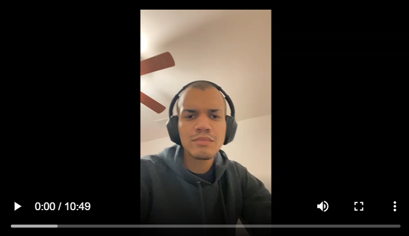

# Twilight Player

<em>How audio should be played</em>

* * *

What exactly is Twilight Player?
================================

Twilight Player is a media player that lets you convert your audio files into high-quality sounding and playable media files. 

* * *

What features does the app offer?
=================================

Users have access to personally made playlists for files they have downloaded or they can also create their own personal playlists in case they only want specific audio files in one place. All you have to do is press the "Add" button and it will prompt you to give the playlist a name and after the playlist is created, you can add any files you would like.  

* * *

Why choose Twilight Player?
===========================

Not only do we offer superb audio conversion and an easy user interface, we are also completely free with no catches or pesky ads. Go ahead and register an account, it is easy! All you need is a username and a password. 

* * *

Want to see Twilight Player in action?
======================================

* * *

### Download Twilight Player here:
<a href="Twilight-ex-master.zip" download> Twilight Player Zip </a>

### Visit our repo here:
<a href ="https://github.com/SCCapstone/Twilight-ex.git"> Twilight Player</a>

###### [About Us](https://github.com/SCCapstone/Twilight-Player/blob/gh-pages/About-us.md)

